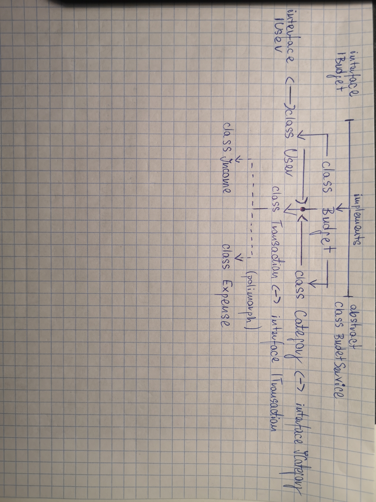

# Budget App - Rozliczanie domowych wydatków.

## I. Wprowadzenie.
Projekt aplikacji budżetowej do użytku domowego, przygotowany w języku `C#` na zajęcia z Programowania obiektowego w ramach studiów informatycznych na WSB w Chorzowie w semestr letnim 2021/2022.

Autorami rozwiązania są: **Daniel Karbownik**, **Wiktor Kapturkiewicz** oraz **Mateusz Stawowski**.

## II. Kluczowe aspekty.
Istotę projektu od strony technicznej stanowi praktyczne zastosowanie najważniejszych technik i założeń `OOP`, takich jak w szczególności:
 - dziedziczenie,
 - interfejsy,
 - polimorfizm,
 - hermetyzacja,
 - projekt klas,
 - biblioteka klas.

Od strony użytkowej aplikacja ma docelowo zapewniać w pierwszym rzędzie następujące funkcjonalności:
1) wyświetlanie listy transakcji z podziałem na wpływy oraz wydatki,
2) obliczanie salda miesięcznego oraz procentowego udziału poszczególnych kategorii wpływów i wydatków,
3) definiowanie kategorii transakcji,
4) definiowanie użytkowników (tj. domowników, których transakcje będą rozliczane w ramach budżetu)
5) dodawanie pojedynczej transakcji,
6) modyfikacja oraz usuwanie elementów wymienionych w punktach 3-5.

W pierwszej fazie rozwoju program będzie funkcjonował jako **aplikacja konsolowa**, obsługiwana z wykorzystaniem klawiatury. W miarę możliwości planowana jest także implementacja ***interfejsu graficznego***. Podobnież, dla przechowywania danych przewidywana jest współpraca programu z **bazą danych**, którą początkowo stanowił będzie prosty plik `JSON`, natomiast w miarę postępów i rozrostu aplikacji docelowym miejscem gromadzenia danych ma zostać bezpieczna baza.
 
## Sekcja **List**
 - transakcje przypisane do poszczególnych miesięcy (I) oraz kategorii (II) - w ramach lewej i prawej strony budżetu (wpływy/wydatki) (III),
 - dane pobierane są z bazy (np. pliku `JSON`),
 - należy zadbać o przejrzystość i estetykę listy (formatowanie w konsoli, później ew. graficzny interfejs). - 
 
## Sekcja **Summary**
- saldo: suma wartości pól ***amount*** wszystkich obiektów **Transaction**,
- ww. obiekty są uprzednio filtrowane wg miesięcy (pole ***date***),
- sumy obliczane są także dla wszystkich transakcji danej kategorii,
- po obliczeniu ww. sum uzyskuje się procentowy udział kategorii transakcji we wpływach i wydatkach za dany miesiąc,
- rezeprezentacja: liczbowa (zestawienie w konsoli) i ew. graficzna (wykres?).

## Sekcja **Categories** <=> Klasa `Category`
        {
            type: 'income' || 'expense' (string),
            name: nazwa kategorii (string).
        }
        
## Sekcja **Transactions** <=> Klasa `Transaction`
        {
            transactionNumber: numer transakcji generowany automatycznie (int),
            category: zamknięta lista (Category), determinuje typ (income/expense),
            amount: kwota w PLN (double),
            date: data transakcji (Date) - pełna lub tylko miesiąc,
            description: opis transakcji (string) - pole opcjonalne,
            user: osoba ponosząca wydatek/dostarczająca wpływ (string)*.
        }
* do rozważenia pozostaje sposób zdefiniowania na początku działania programu liczby domowników i ich imion (klasa `User`),
* ***dodawanie transakcji*** powinno być możliwe poprzez wypełnienie formularza (graficznego lub w konsoli), który będzie uzupełniać listę transakcji poprzez stworzenie nowej instancji oraz przesłanie jej zawartości do bazy (pliku),
* ***modyfikowanie/usuwanie transakcji*** powinno być możliwe poprzez wpisanie opisu poszukiwanej transakcji (pole `description`) lub jej numeru (pole `transactionNumber`), natomiast w interfejscie graficznym w drodze kliknięcia wybranego fragmentu list
        - ***edycja*** to ponowne uzupełnienie pól (puste nie będą modyfikowane) i aktualizacja listy oraz bazy transakcji,
        - ***usuwanie*** powinno następować po upewnieniu się, że użytkownik wybrał właściwą transakcję i potwierdza operację.

## Wstępny schemat klas składowych aplikacji.

